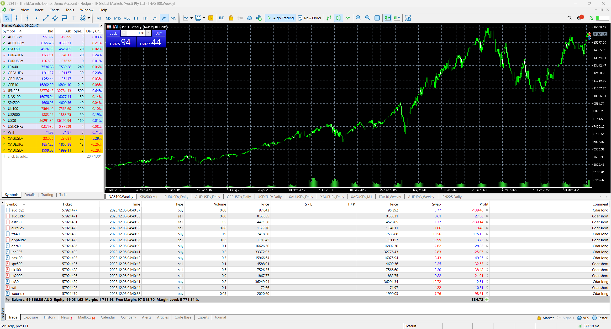

# Capstone Project 

This README has been created to define our project scope and overview of the algorithmic trading project. Exploring the problem, questions, datasources and goals.

## Table of Contents
- [Introduction](#introduction)
- [Prerequisites](#Prerequisites)
- [Usage](#Usage)
- [Description](#description)
- [Contributing](#contributing)
- [License](#license)

## Introduction

For our capstone project we have elected to develop a proprietary algorithm trading in various forms of equities. Utilising MetaTrader5 (MT5) platform we will fetch financial data for assets, optimise the porfolio and execute market orders based on calculated weights.

## Prerequisites

Ensure you have the following Python packages installed.

1.
Install MetaTrader 5 
https://www.icmarkets.com.au/en/forex-trading-platform-metatrader/metatrader-5?utm_term=meta%20trading%205&utm_campaign=&utm_source=adwords&utm_medium=ppc&hsa_acc=3146719224&hsa_cam=19901135271&hsa_grp=142828755330&hsa_ad=671302925423&hsa_src=g&hsa_tgt=kwd-298601236286&hsa_kw=meta%20trading%205&hsa_mt=b&hsa_net=adwords&hsa_ver=3&gad_source=1&gclid=CjwKCAiA98WrBhAYEiwA2WvhOt61m4-yvlO52tpntHdp1UvFLUqZANJGGWjcbRn7y64nnupAinhwiRoCLvYQAvD_BwE 


2.
* Open a new terminal Window

```shell
pip install MetaTrader5
python-dotenv
pandas
numpy
pytz
hvplot.pandas
pypfopt 
matplotlib
seaborn
scipy 
```


## Usage

1. Complete the Prerequisite instructions
2. Update the '.env' file with your own MetaTrader5 account credentials
3. Open notebook/mt5-project-Duke.ipynb
4. Run the notebook

## Description
1. Initialize MetaTrader5 Connection:

Connects to MetaTrader5 using the provided credentials from the .env file.

2. Retrieve Account Information:

Fetches and displays relevant account information such as profit, equity, margin, and margin-free.

3. Download Ticker Data:

Retrieves historical daily ticker data for various financial instruments (Forex pairs, commodities, indices, and cryptocurrencies) from MetaTrader5.

4. Data Cleaning and Export:

Cleans the obtained data, removes NaN values, and exports the cleaned data to a CSV file (project_data.csv).

5. Portfolio Optimization:

Utilizes the PyPortfolioOpt library to perform portfolio optimization based on mean-historical returns and risk models.
Generates efficient frontier plots and calculates Sharpe ratios.

6. Currency Conversion:

Converts portfolio weights to AUD and performs optimization, considering AUD as the base currency.

7. Risk Management:

Implements Conditional Drawdown at Risk (CDaR) optimization for risk management.
Displays portfolio performance metrics and weight plots.

8. Position Sizing and Lot Calculation:

Calculates position sizes based on portfolio weights and lot sizes for trading on the MetaTrader5 platform.

9. MetaTrader5 Execution:

Executes market orders (long or short) based on optimized portfolio weights.

## Contributing
We welcome contributions, provide guidelines for how others can contribute to your project. Include details about bug reporting, feature suggestions, and pull requests.

## License
This project is licensed under the MIT License.


